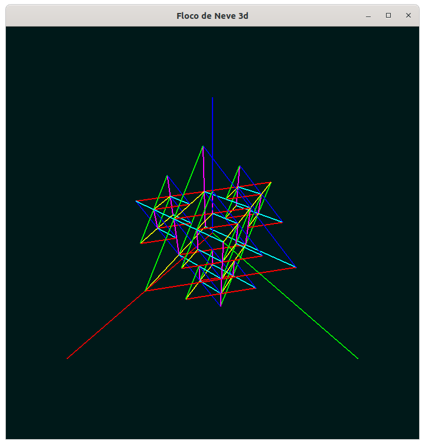

# Fractais #

## Descrição ##

Este repositório reúne as implementações de alguns fractais que fiz durante a
minha iniciação científica na UFPR, utilizando C++ e OpenGl.

As versões iniciais se basearam em exemplos obtidos na internet. No entanto,
infelizmente já não tenho registros dos websites específicos (me avise caso
identifique algum, e darei os créditos devidos).

Os arquivos `screenshot.png` de cada subpasta `imagens` são capturas da tela
inicial de cada versão dos programas, ao executá-los com Wine 5.0 no Ubuntu
20.04. As demais capturas de tela foram feitas em um sistema Windows, na mesma
época em que os fractais foram implementados. A execução requer o arquivo
`glut32.dll`.

**Nota**: Como só passei a usar Git posteriormente, as datas dos commits deste
repositório são aproximadas, com base nas datas de modificação dos arquivos.

## Galeria ##

A seguir estão reunidas algumas capturas de tela dos programas implementados.

### Curva de Koch em 2D ###

### Árvores ###

### Esponja de Menger ###

### Floco de neve de Kock em 3D ###

### Pirâmide de Sierpinski ###

### Poeira de Cantor ###

